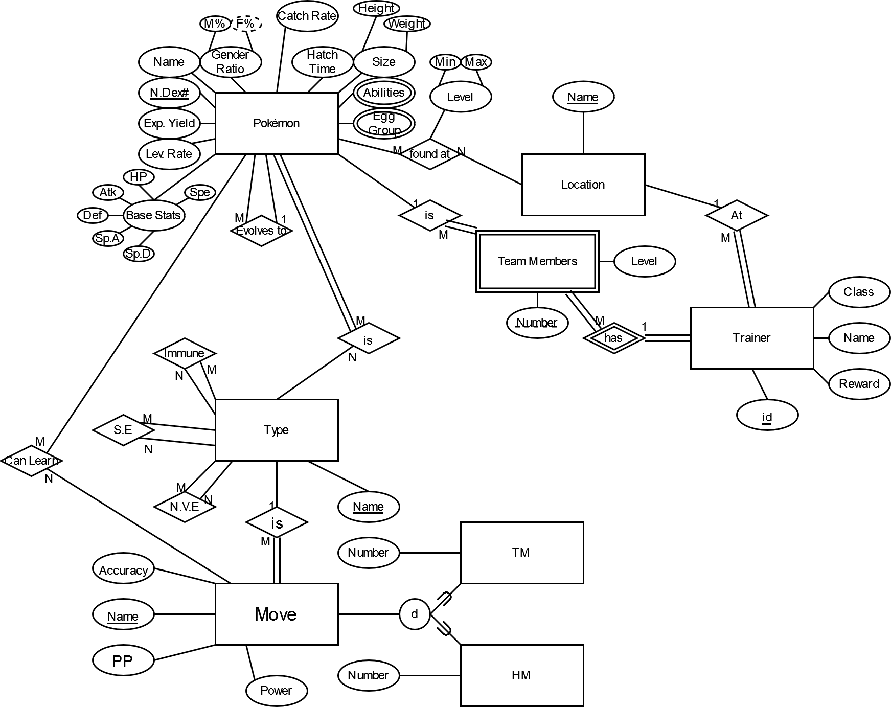

# Pokémon Database

Tracking data about Pokémon.

Collected from [Pokemon Showdown source code](https://github.com/smogon/pokemon-showdown) and [Bulbapedia](https://bulbapedia.bulbagarden.net/wiki/Main_Page).

## Sources:  
- <a href="https://github.com/smogon/pokemon-showdown/blob/master/data/pokedex.ts" target="_blank">Pokemon List/Previous Evolution</a>
- <a href="https://bulbapedia.bulbagarden.net/wiki/List_of_moves" target="_blank">Moves</a>
- <a href="https://bulbapedia.bulbagarden.net/wiki/Type" target="_blank">Types</a>
- <a href="https://bulbapedia.bulbagarden.net/wiki/TM" target="_blank">TM</a>
- <a href="https://bulbapedia.bulbagarden.net/wiki/HM" target="_blank">HM</a>
- <a href="https://bulbapedia.bulbagarden.net/wiki/List_of_Pok%C3%A9mon_by_Ability" target="_blank">Ability</a>
- <a href="https://bulbapedia.bulbagarden.net/wiki/List_of_Pok%C3%A9mon_by_National_Pok%C3%A9dex_number" target="_blank">Pokemon Type</a>
- <a href="https://bulbapedia.bulbagarden.net/wiki/List_of_Pok%C3%A9mon_by_base_Egg_cycles" target="_blank">Egg Groups</a>
- <a href="https://bulbapedia.bulbagarden.net/wiki/List_of_Pok%C3%A9mon_by_experience_type" target="_blank">Experience Type</a>
- <a href="https://bulbapedia.bulbagarden.net/wiki/List_of_Pok%C3%A9mon_by_effort_value_yield" target="_blank">Exp. Yield</a>
- <a href="https://bulbapedia.bulbagarden.net/wiki/List_of_Pok%C3%A9mon_by_catch_rate" target="_blank">Catch Rate</a>
- <a href="https://bulbapedia.bulbagarden.net/wiki/List_of_Pok%C3%A9mon_by_gender_ratio" target="_blank">Gender Ratio</a>
- <a href="https://github.com/smogon/pokemon-showdown/blob/master/data/learnsets.ts" target="_blank">Learnsets</a>

### To be used:
- https://bulbapedia.bulbagarden.net/wiki/Category:Hoenn_locations
- https://bulbapedia.bulbagarden.net/wiki/Hoenn
- https://bulbapedia.bulbagarden.net/wiki/List_of_routes
- https://bulbapedia.bulbagarden.net/wiki/Pok%C3%A9mon_Trainer
