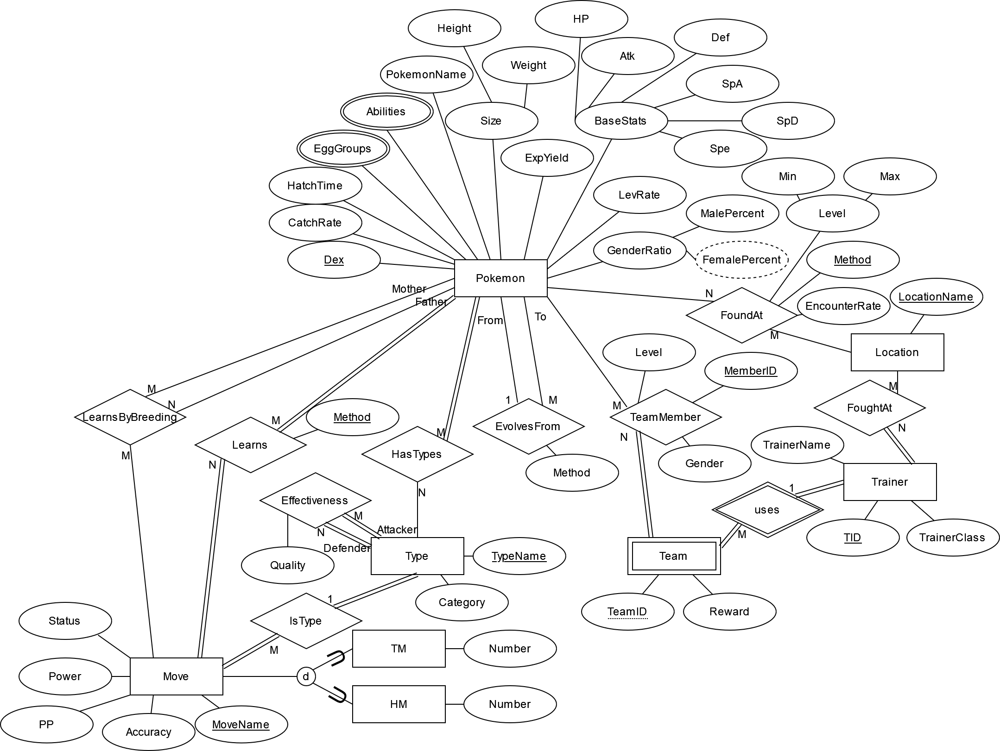

# Pokémon Database

Tracking data about Pokémon Emerald.



Collected from [Bulbapedia](https://bulbapedia.bulbagarden.net/wiki/Main_Page).

## How to run
### Linux
```
.../3380_Project $ ./run-linux.sh
```
Press CTRL+C to close the server.
### Windows
```
...\3380_Project>run-windows.bat
```
Press CTRL+C in each cmd window to close the server.
### Mac (not set up yet)
Use Linux version for now. Run `pkill flask` after closing the server.
